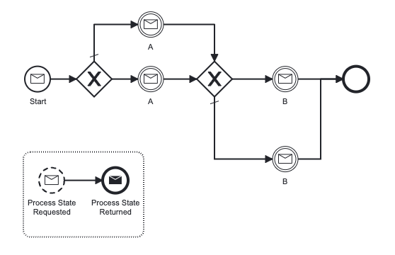

[](https://github.com/Camunda-Community-Hub/community/blob/main/extension-lifecycle.md#incubating-)
[](https://github.com/camunda-community-hub/community)

# Motivation
With BPMN we describe a well-defined structured flow in which a process should be executed.</br>
It is possible to model a process which only contains Intermediate Message Catch Events to display the current state of a process.</br>
This only works out-of-the box though, if all required Messages arrive in the modeled order.</br>

The real world, however, sometimes is messy and Messages might arrive out-of-order. This project allows handling of such scenarios.</br>

# Usage
- Process has to be started via `ZeebeService.startProcessViaMessage()`.
  -  to-be-correlated Messages have to be added by Client to processVars as a Map<String, MessageBody> with variableName=`message-correlator.messagesProcessVar`
- Subsequent messages have to be sent via `ZeebeService.sendArbitraryMessage()`.

# Behaviour
- If the process is currently waiting for the Message, it will get correlated.
- If the process is waiting for a Message and receives a subsequent message with more recent timestamp, all messages on the way to the subsequent message will get send (with `synthetic=true` and a timestamp 1 millisecond earlier), so the process will reach the wanted state. The shortest path will be used.
- If the process is waiting for a message and receives a Message with an earlier timestamp, it won't get processed.
- Loops are possible.
- Event-based Subprocesses will get sent directly.

# Prerequisites
- Possibility to request state from Zeebe: Process must contain an event-based SubProcess with
  - MessageStartMessage of type `message-correlator.syncMessage`
  - MessageEndEvent with TaskDefinition of type `message-correlator.syncTaskTypePrefix`+`id`
  - In the future this might also be possible to do via Operate API, see https://github.com/camunda-community-hub/message-correlator/issues/15
- The process must be modeled so that the same Message will always lead to the same succeeding Message Event (exception: event-based subprocesses)

## Example Process Model
</br>
see also src/test/resources/client_example/example_process.bpmn

# Configuration
Properties file `application.properties` has to exist.</br>
Properties `message-correlator.path`, `message-correlator.syncMessage`, `message-correlator.syncTaskTypePrefix` and have to be set.</br>
Optionally `message-correlator.messagesProcessVar` can be set (defaults to 'messages').

## Example Configuration
```
message-correlator.path=src/test/resources/client_example/example_process.bpmn
message-correlator.syncMessage=Msg_ProcessState
message-correlator.syncTaskTypePrefix=processState_
message-correlator.messagesProcessVar=messages
```
see also src/test/resources/client_example/example_application.properties

# Limitations
- Process can currently only move forward
  - In the future it might also be possible to move process back using Process Instance Modification, see https://github.com/camunda-community-hub/message-correlator/issues/16
- Process currently has to be started via Message
  - In the future, other start possibilities will be available, see https://github.com/camunda-community-hub/message-correlator/issues/17
